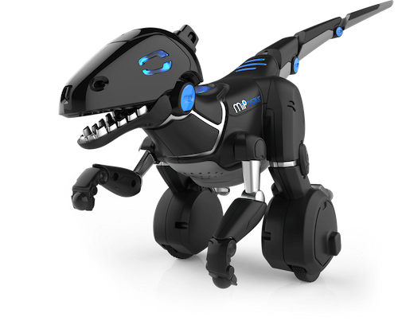
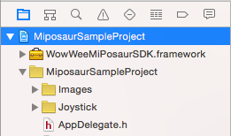
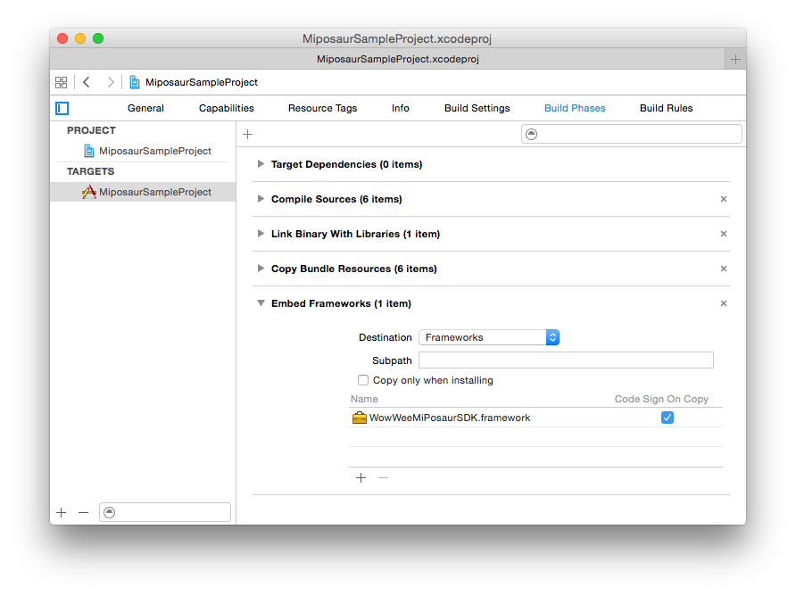
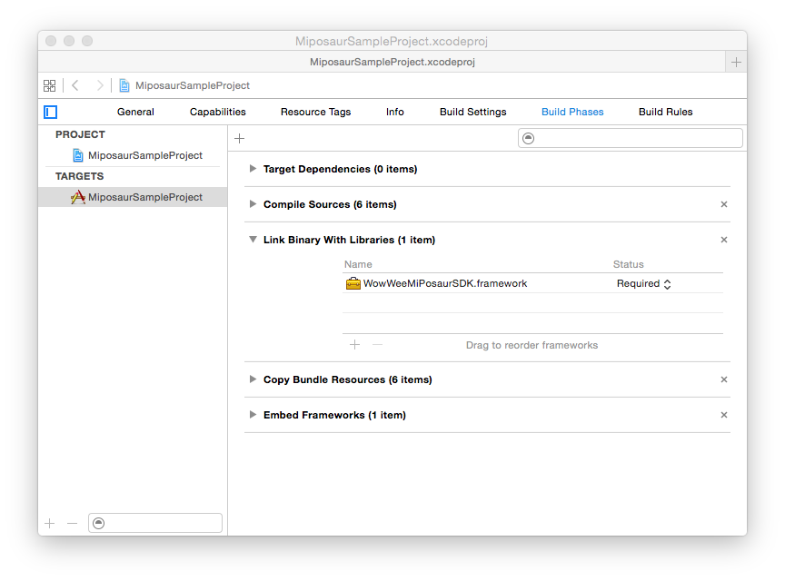

# MiPosaur-iOS-SDK
WowWee MiPosaur iOS SDK
================================

The free MiPosaur iOS SDK lets you control your [WowWee MiPosaur robot](http://wowwee.com/miposaur/) on devices running iOS 8.0 and above and Xcode 6. To use this SDK you will also need a physical MiPosaur robot.

For information on WowWee products visit: <http://www.wowwee.com>

Table of Contents
---------------------------------------

- [Quick Installation](#quick-installation)
- [Notes about the SDK](#notes-about-the-sdk)
- [Using the SDK](#using-the-sdk)
	- [Finding a MiPosaur](#finding-mips)
- SDK Documentation (coming soon)
- [License](#license)
- [Contributing](#contributing)
- [Credits](#credits)
- [Projects using this SDK](#projects-using-this-sdk)

Quick Installation
---------------------------------

1. Clone the repository

		git clone https://github.com/WowWeeLabs/MiPosaur-iOS-SDK.git

2. In XCode, create a new project. The simplest application is a Single-View application.

3. Open the project navigator in Xcode and drag the **WowWeeMiPosaurSDK.framework** file from the Mac OS Finder to the Frameworks directory for your project in XCode.

4. Confirm that the framework is added to your project by going into _Project Settings_ (first item in the project navigator), then click the first target (e.g. _MiPosaurSampleProject_), then _Build Phases_. If there is not a _"Copy Files"_ phase., click the top left + to add one. Set the destination to _"Frameworks"_ and add the framework file under the _"Name"_ section.

Also make that the framework is present under the _"Link Binary With Libraries"_ section.
	

5. In the ViewController.h file, add the following line at the top of the file:

		@import WowWeeMiPosaur;
	
Alternatively you can add this line into your Project-Prefix.pch (e.g. _MiPosaurSampleProject-Prefix.pch_) file so that you don't need to import in each class your planning to use the SDK in.
	
6. Check that the project compiles successfully after completing the above steps by pressing ⌘+b in Xcode to build the project. The project should build successfully.

7. Choose the classes you want to handle the delegate callbacks from a MiPosaur Robot, these classes will receive callbacks for when events happen (such as finding a new robot, robot connected, robot falls over etc) in this case we will simply choose our ViewController.

To receive MiPosaur Finder notifications, in the ViewController.m file, modify the following sections:
	
    - (void)viewDidLoad {
        [super viewDidLoad];
        // Do any additional setup after loading the view, typically from a nib.
        
        [self addNotificationObservers];
        [MiposaurRobotFinder sharedInstance];
    }
    
    - (void)dealloc {
        [self removeNotificationObservers];
        self.miposaur = nil;
    }
        
    
		
    - (void)miposaurFoundNotification:(NSNotification *)note {
        NSLog(@"- (void)miposaurFoundNotification:(NSNotification *)note");
        NSDictionary *noteDict = note.userInfo;
        if (!noteDict || !noteDict[@"code"]) {
            return;
        }
        MiposaurRobotFinderNote noteType = (MiposaurRobotFinderNote)[noteDict[@"code"] integerValue];
        
        if (noteType == MiposaurRobotFinderNote_MiposaurFound) {
            MiposaurRobot *miposaur = noteDict[@"data"];
            // Normally you might want to add this object to an array and use a UITableView to display all the found devices for the user to select. For now we just want to print this MiPosaur to the console
            NSLog(@"Found: %@", miposaur);
            self.miposaurStatusLabel.text = [NSString stringWithFormat:@"Found MiP: %@", miposaur.name];
            
            // We have one MiPosaur so stop scanning
            [[MiposaurRobotFinder sharedInstance] stopScanForMiposaurs];
            
            // Before connecting we want to setup which class is going to handle callbacks, for simplicity we are going to use this class for everything but normally you might use a different class
            miposaur.delegate = self;
            
            self.miposaurStatusLabel.text = [NSString stringWithFormat:@"Connecting: %@", miposaur.name];
            
            // Lets connect
            [miposaur connect];
        } else if (noteType == MiposaurRobotFinderNote_BluetoothError) {
            CBCentralManagerState errorCode = (CBCentralManagerState)[noteDict[@"data"] integerValue];
            if (errorCode == CBCentralManagerStateUnsupported) {
                NSLog(@"Bluetooth Unsupported on this device");
                self.miposaurStatusLabel.text = @"Bluetooth Unsupported on this device";
            } else if (errorCode == CBCentralManagerStatePoweredOff) {
                NSLog(@"Bluetooth is turned off");
                self.miposaurStatusLabel.text = @"Bluetooth Unsupported on this device";
            }
        } else if (noteType == MiposaurRobotFinderNote_BluetoothIsAvailable) {
        }
    }

    To receive MiPosaur callbacks, in the ViewController.h file, change the interface to match the following:

		@interface ViewController <MiPosaurRobotDelegate>
	
	In the interface definition add the following callbacks:
	
    - (void) MiposaurDeviceReady:(MiposaurRobot *)miposaur{
			NSLog(@"We are connected to MiPosaur and ready to go");
		}

    - (void) MiposaurDeviceDisconnected:(MiposaurRobot *)mip error:(NSError *)error {
			NSLog(@"A mip was disconnected");
		}

8. You should be now ready to go! Plug in an iOS device then compile and run the project using ⌘+r . When you turn on a MiPosaur you should see some debug messages in the logs.

Using the SDK
---------------------------------

### Finding MiPosaurs
Once your application is listening to notifications, you need to issue the following call:

	[[MiposaurRobotFinder sharedInstance] scanForMips];

Scanning is battery intensive so we recommend you don't continuously scan, instead you can use this to scan for 5 seconds then stop:

	[[MiposaurRobotFinder sharedInstance] scanForMipsForDuration:5];

After a miposaur is found, the MiposaurRobotFinder will send a notification with the following dictionary for the notification userInfo 

	{
		"code": MiposaurRobotFinderNote_MiposaurFound,
		"data": <MiposaurRobot>		
	}

You can handle this notification using the following snippet from the sample project

	- (void)miposaurFoundNotification:(NSNotification *)note {
		if (noteType == MiposaurRobotFinderNote_MiposaurFound) {
	        MiposaurRobot *miposaur = noteDict[@"data"];
	        NSLog(@"Found: %@", miposaur);
	    }
	}

In our sample project we automatically connect to the first MiPosaur we find, however you can store these references and use them later, there is no need to connect initially. 

#### Special Note about using MipRobot objects
When MiPosaurs are no longer available (e.g. the player turns one off), they will still contain a valid MipRobot instance object. The only way to know if the MiPosaur is available is to try to connect to it, or do another scan.

Notes about the SDK
---------------------------------

### CocoaPods Compatible

For now we do not support CocoaPods. Pull requests are welcome.

### Apple Watch Support

At present we don't have an Apple Watch device to test with. When it becomes available we are open to adding support for WatchKit.

### Full Source Code

At this stage we do not plan on releasing our full library source code. 

### Are there any restrictions on releasing my own application?

The SDK is currently and will always be free for you to build and release your own applications. Your welcome to charge money or release free applications using our SDK without restrictions.

If you create a great application, all we ask is that you provide a link for people to purchase their own MiPosaur so they can enjoy your product.

### OSX Support

Currently the SDK is not available for OSX however we will make this available if it's important to you. If that's the case please open up an issue in the bug tracker.
.
### Can I use your cool joystick class?

Yes we have provided the source code in our sample project, feel free to use this or make changes as you want. We would love pull requests.

License
---------------------------------
MiPosaur iOS SDK is available under the Apache License, Version 2.0 license. See the [LICENSE.txt](https://raw.githubusercontent.com/WowWeeLabs/MiPosaur-iOS-SDK/master/LICENSE.md) file for more info.

You are free to use our SDK in your own projects whether free or paid. There are no restrictions on releasing into the Apple App Store or Google Play.

Contributing
---------------------------------
We happily accept any pull requests and monitor issues on GitHub regularly. Please feel free to give us your suggestions or enhancements. Please note that due to resource constraints we most likely cannot add new features to the MiPosaur robot himself, but we will certainly consider them for inclusion to future robots/versions.

Tell your friends, fork our project, buy our robot and share with us your own projects! These are the best kinds of positive feedback to us.

Credits
---------------------------------
* [YMSCoreBluetooth](https://github.com/kickingvegas/YmsCoreBluetooth.git) & [Our Fork](https://github.com/WowWeeLabs/YmsCoreBluetooth)
* [MSWeakTimer](https://github.com/mindsnacks/MSWeakTimer)
* [NSTimer-Blocks](https://github.com/jivadevoe/NSTimer-Blocks)
* [OWQueueStack](https://github.com/yangyubo/OWQueueStack)

Projects using this SDK
---------------------------------
* [WowWee MiPosaur Official App](https://itunes.apple.com/hk/app/miposaur/id982095901?mt=8) - Official app developed by WowWee using this SDK.
* Send us a pull request to add your app here
MiPosaur-iOS-SDK